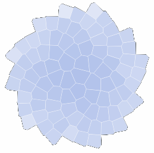

# Visualizing Censorship in Iran (SVG version)

>Code base for the visualization of censorship in Iran



A canvas version runs [here](https://visualization.journalismisnotacrime.com).
Canvas version code is located [here](https://github.com/higsch/censorship-in-iran).


## Run locally

```bash
git clone
npm install
npm run dev
```

Navigate to [localhost:5000](http://localhost:5000).
